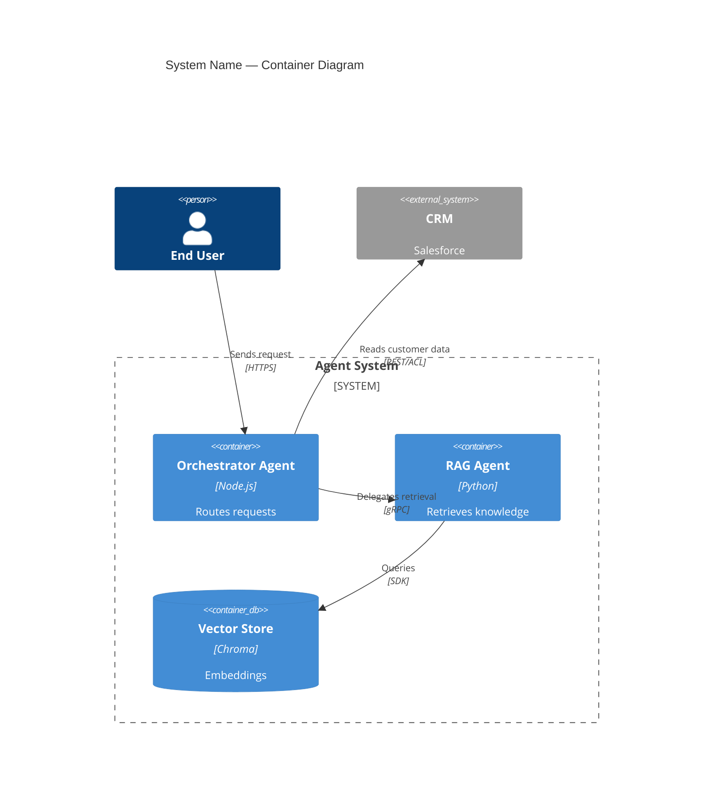

# Architecture Documentation and Communication

## ADR (Architecture Decision Record)

Write an ADR for every decision that:
- Has real alternatives that were considered
- Affects multiple components or teams
- Will be difficult or costly to reverse
- Would confuse a new team member if not explained

**ADR Template:**
```markdown
# ADR-NNN — [Decision Title]

**Status:** Proposed | Accepted | Deprecated | Superseded by ADR-XXX
**Date:** YYYY-MM-DD

## Context
[Problem being solved. Constraints. Why a decision is needed now.]

## Decision
[What was decided, in one or two sentences.]

## Justification
[Why this is the right choice for this specific system. Tie each point to a stated requirement or constraint.]

## Consequences
**Positive:** (list)
**Negative:** (list)

## Alternatives Rejected
**[Alternative A]:** [Why rejected — be specific, not generic]
**[Alternative B]:** [Why rejected]

## When to Reconsider
[The conditions that would make this decision wrong — e.g., "If monthly volume exceeds 1M requests, revisit in-memory LTM."]
```

## C4 Model

Four levels of abstraction:

**Level 1 — Context**: the system and everything external to it. Shows users, external systems, and the box labeled "your system." Audience: non-technical stakeholders.

**Level 2 — Container**: internal components (services, databases, agents, queues). Shows technology choices and communication protocols. Audience: architects, tech leads.

**Level 3 — Component**: internals of a specific container. Audience: developers working on that container.

**Level 4 — Code**: class/module level. Rarely drawn — usually auto-generated.

For most communication needs: Level 1 + Level 2 are sufficient.

**Mermaid C4Container example:**


## Communication by Audience

| Audience | Format | Length | Focus |
|---|---|---|---|
| C-Level | Executive Summary | 1 page | Decision needed, investment, risk, timeline |
| Product / Business | Product Brief | 3 pages | Problem, solution, outcomes, dependencies |
| Engineering Leadership | Technical Brief | 5 pages | Architecture overview, NFRs, risks |
| Architects / Tech Leads | RFC | 15 pages | Full technical decision, alternatives, implementation |
| Developers | Technical Spec | 20+ pages | Implementation details, contracts, tests |

## Trade-Off Analysis Framework

When presenting multiple architectural options, use weighted scoring:

1. Choose 5–7 criteria relevant to this system's priorities
2. Assign weights (total = 100%)
3. Score each option 1–10 per criterion
4. Calculate weighted total

Example criteria and weights for a cost-sensitive system:
- Cost per request: 30%
- Latency P95: 25%
- Operational complexity: 20%
- Team familiarity: 15%
- Scalability ceiling: 10%

Present the matrix, then explain the reasoning behind the winner — the number is a discussion tool, not the final word.

## RFC (Request for Comments)

Use RFC when:
- Decision affects multiple teams and needs broader input
- Significant investment or irreversibility is involved
- You want documented evidence of the deliberation process

RFC lifecycle: Draft → In Review (2-week window) → Approved/Rejected → Implemented

RFC must capture: the final decision, who approved it, what was the deciding rationale.

## Perguntas diagnósticas
1. Who are the audiences that need to understand this architecture decision?
2. Are there alternatives that were seriously considered? Document them in an ADR.
3. Is this decision reversible? If not, it needs more deliberation and documentation.
4. At which C4 level should this be communicated — context, container, or component?
5. Does this decision require RFC-level consensus, or is an ADR sufficient?
6. How will new team members understand why this architecture was chosen in 12 months?
