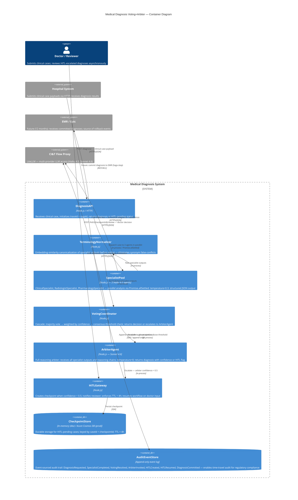

# Container Diagram — Medical Diagnosis Voting+Arbiter



## Component Notes

| Container | Key Design Decision |
|---|---|
| TerminologyNormalizer | Embedding-similarity canonicalization mandatory before vote aggregation — prevents string-comparison false conflicts (IAM synonym bug from exercise). +200–500ms latency accepted per resolved tension. |
| SpecialistPool | Promise.allSettled — never Promise.all. Partial failures (1 of 3 specialists fails) are handled per-agent: degraded voting with 2 agents, not total failure. |
| VotingCoordinator | Cascade terminates at first resolution: majority → weighted → threshold. Only calls ArbiterAgent when all deterministic levels fail (~30–40% of cases per exercise baseline). |
| ArbiterAgent | Full-reasoning context (all specialist outputs + reasoning chains). temperature=0 mandatory for reproducible arbitration. |
| HITLGateway | Async doctor review — workflow suspends. TTL = 4h. On expiry: stoppedBy="hitl_timeout", care team notified, case logged in AuditEventStore. |
| AuditEventStore | Append-only, never mutated. sagaId propagated in every event. Enables time-travel reconstruction for regulatory audit (HIPAA-equivalent). |
| CheckpointStore | MemorySaver = development only. Production requires durable storage (Azure Cosmos DB) — process restart must not lose pending HITL cases. |
```
