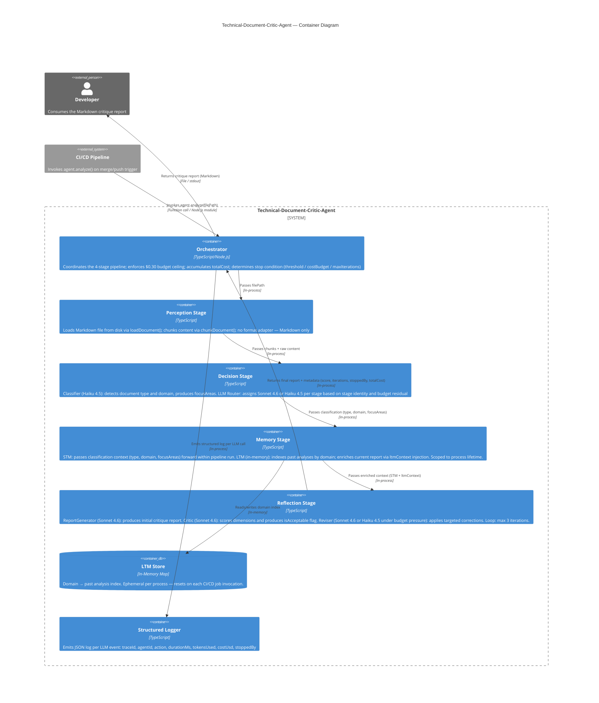

# Technical-Document-Critic-Agent — Container Diagram

## Component Notes

| Component | Model | Notes |
|---|---|---|
| Classifier | Haiku 4.5 | Simple classification task — domain-specific signals sufficient; ~10× cheaper than Sonnet |
| LLM Router | — (deterministic) | No LLM call — routes by stage name + budget residual; Reviser → Haiku when totalCost/budget > 0.70 |
| ReportGenerator | Sonnet 4.6 | Complex synthesis — requires full capability |
| Critic | Sonnet 4.6 | Qualitative evaluation — same-model bias risk; acceptable for this scope |
| Reviser | Sonnet 4.6 → Haiku 4.5 | Switches to Haiku when budget > 70% consumed |
| LTM Store | In-memory Map | Ephemeral; value only when ≥2 docs of same domain processed in the same job |
