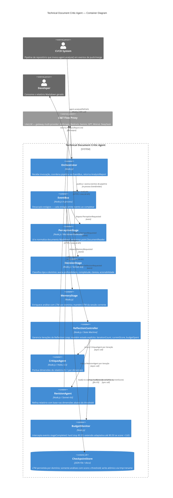

# Technical Document Critic Agent — Container Diagram

```mermaid
C4Container
  title Technical Document Critic Agent — Container Diagram

  Person_Ext(ciSystem, "CI/CD System", "Pipeline de repositório que invoca agent.analyze() em eventos de push/merge")
  Person_Ext(developer, "Developer", "Consome o relatório Markdown gerado")

  System_Boundary(agent, "Technical Document Critic Agent") {
    Container(orchestrator, "Orchestrator", "Node.js", "Recebe invocação, coordena pipeline via EventBus, retorna AnalysisReport")
    Container(eventBus, "EventBus", "Node.js in-process", "Desacopla estágios — cada estágio emite evento ao completar")
    Container(perception, "PerceptionStage", "Node.js / MarkdownFileReader", "Lê e normaliza documento Markdown; extension point DocumentReader")
    Container(decision, "DecisionStage", "Node.js / Sonnet 4.6", "Classifica tipo e domínio; avalia profundidade, completude, clareza, acionabilidade")
    Container(memory, "MemoryStage", "Node.js", "Enriquece análise com LTM por domínio; mantém STM da sessão corrente")
    Container(reflection, "ReflectionController", "Node.js / State Machine", "Gerencia iterações de Reflection Loop; mantém estado explícito: iterationCount, currentScore, budgetSpent")
    Container(critique, "CritiqueAgent", "Node.js / Haiku 4.5", "Pontua dimensões do relatório (0–1 por dimensão)")
    Container(revision, "RevisionAgent", "Node.js / Sonnet 4.6", "Refina relatório com base nas dimensões abaixo do threshold")
    Container(budgetMonitor, "BudgetMonitor", "Node.js", "Intercepta evento stageCompleted; hard stop $0.30; extensão adaptativa até $0.50 se score > 0.65")
    ContainerDb(checkpointStore, "CheckpointStore", "JSON File / disco", "LTM persistida por domínio; somente análises com score ≥ threshold; write atômico via tmp+rename")
  }

  System_Ext(flowProxy, "CI&T Flow Proxy", "LiteLLM — gateway multi-provider: Anthropic, Bedrock, Gemini, GPT, Mistral, DeepSeek")

  Rel(ciSystem, orchestrator, "agent.analyze(filePath)", "Node.js SDK call")
  Rel(orchestrator, eventBus, "publica / assina eventos de pipeline", "in-process EventEmitter")
  Rel(eventBus, perception, "dispara PerceptionRequested", "event")
  Rel(eventBus, decision, "dispara DecisionRequested", "event")
  Rel(eventBus, memory, "dispara MemoryRequested", "event")
  Rel(eventBus, reflection, "dispara ReflectionRequested", "event")
  Rel(reflection, critique, "invoca CritiqueAgent por iteração", "async call")
  Rel(reflection, revision, "invoca RevisionAgent por iteração", "async call")
  Rel(reflection, budgetMonitor, "checkAndExtend(costSoFar, currentScore)", "sync call")
  Rel(memory, checkpointStore, "load() no startup; save() no encerramento", "file I/O")
  Rel(decision, flowProxy, "classify + evaluate", "HTTPS / LiteLLM API")
  Rel(critique, flowProxy, "score dimensions", "HTTPS / LiteLLM API")
  Rel(revision, flowProxy, "refine report", "HTTPS / LiteLLM API")
  Rel(orchestrator, developer, "retorna AnalysisReport.md", "file output")
```
