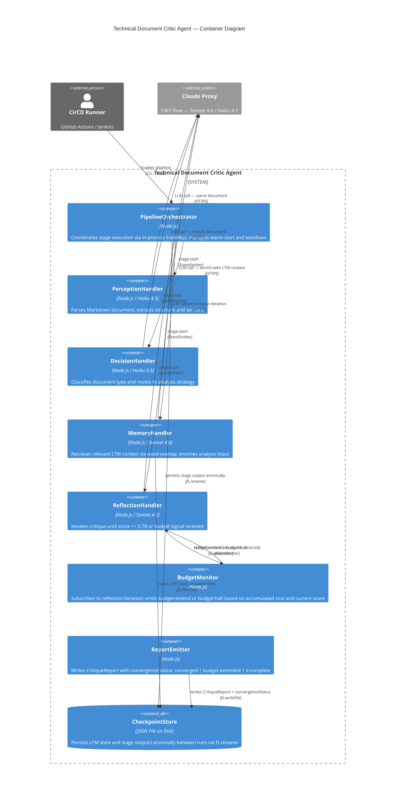

```mermaid
C4Container
  title Technical Document Critic Agent — Container Diagram

  Person_Ext(cicd, "CI/CD Runner", "GitHub Actions / Jenkins")
  System_Ext(proxy, "Claude Proxy", "CI&T Flow — Sonnet 4.6 / Haiku 4.5")

  System_Boundary(pipeline, "Technical Document Critic Agent") {
    Container(orchestrator, "PipelineOrchestrator", "Node.js", "Coordinates stage execution via in-process EventBus; manages warm-start and teardown")
    Container(perception, "PerceptionHandler", "Node.js / Haiku 4.5", "Parses Markdown document; extracts structure and sections")
    Container(decision, "DecisionHandler", "Node.js / Haiku 4.5", "Classifies document type and routes to analysis strategy")
    Container(memory, "MemoryHandler", "Node.js / Sonnet 4.6", "Retrieves relevant LTM context via word-overlap; enriches analysis input")
    Container(reflection, "ReflectionHandler", "Node.js / Sonnet 4.6", "Iterates critique until score >= 0.78 or budget signal received")
    Container(budget, "BudgetMonitor", "Node.js", "Subscribes to reflection:iteration; emits budget:extend or budget:halt based on accumulated cost and current score")
    Container(reporter, "ReportEmitter", "Node.js", "Writes CritiqueReport with convergenceStatus: converged | budget-extended | incomplete")
    ContainerDb(checkpoint, "CheckpointStore", "JSON File on Disk", "Persists LTM state and stage outputs atomically between runs via fs.rename")
  }

  Rel(cicd, orchestrator, "Invokes pipeline", "CLI / node")
  Rel(orchestrator, perception, "stage:start", "EventEmitter")
  Rel(orchestrator, decision, "stage:start", "EventEmitter")
  Rel(orchestrator, memory, "stage:start", "EventEmitter")
  Rel(orchestrator, reflection, "stage:start", "EventEmitter")
  Rel(orchestrator, checkpoint, "persists stage output atomically", "fs.rename")
  Rel(perception, proxy, "LLM call — parse document", "HTTPS")
  Rel(decision, proxy, "LLM call — classify document", "HTTPS")
  Rel(memory, proxy, "LLM call — enrich with LTM context", "HTTPS")
  Rel(memory, checkpoint, "reads LTM state on warm-start", "fs.readFile")
  Rel(reflection, proxy, "LLM call per critique iteration", "HTTPS")
  Rel(reflection, budget, "reflection:iteration {score, costUsd}", "EventEmitter")
  Rel(budget, reflection, "budget:extend | budget:halt", "EventEmitter")
  Rel(reporter, checkpoint, "writes CritiqueReport + convergenceStatus", "fs.writeFile")
```
