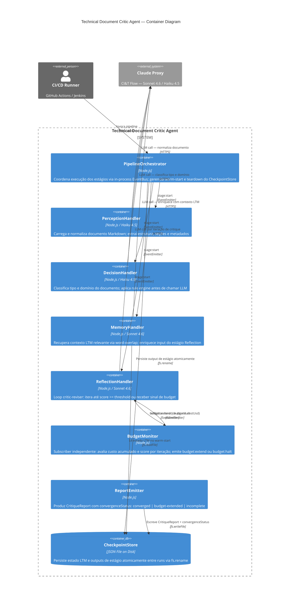

```mermaid
C4Container
  title Technical Document Critic Agent — Container Diagram

  Person_Ext(cicd, "CI/CD Runner", "GitHub Actions / Jenkins")
  System_Ext(proxy, "Claude Proxy", "CI&T Flow — Sonnet 4.6 / Haiku 4.5")

  System_Boundary(pipeline, "Technical Document Critic Agent") {
    Container(orchestrator, "PipelineOrchestrator", "Node.js", "Coordena execução dos estágios via in-process EventBus; gerencia warm-start e teardown do CheckpointStore")
    Container(perception, "PerceptionHandler", "Node.js / Haiku 4.5", "Carrega e normaliza documento Markdown; extrai estrutura, seções e metadados")
    Container(decision, "DecisionHandler", "Node.js / Haiku 4.5", "Classifica tipo e domínio do documento; aplica rule engine antes de chamar LLM")
    Container(memory, "MemoryHandler", "Node.js / Sonnet 4.6", "Recupera contexto LTM relevante via word-overlap; enriquece input do estágio Reflection")
    Container(reflection, "ReflectionHandler", "Node.js / Sonnet 4.6", "Loop critic-reviser: itera até score >= threshold ou receber sinal de budget")
    Container(budget, "BudgetMonitor", "Node.js", "Subscriber independente: avalia custo acumulado e score por iteração; emite budget:extend ou budget:halt")
    Container(reporter, "ReportEmitter", "Node.js", "Produz CritiqueReport com convergenceStatus: converged | budget-extended | incomplete")
    ContainerDb(checkpoint, "CheckpointStore", "JSON File on Disk", "Persiste estado LTM e outputs de estágio atomicamente entre runs via fs.rename")
  }

  Rel(cicd, orchestrator, "Invoca pipeline", "CLI / node")
  Rel(orchestrator, perception, "stage:start", "EventEmitter")
  Rel(orchestrator, decision, "stage:start", "EventEmitter")
  Rel(orchestrator, memory, "stage:start", "EventEmitter")
  Rel(orchestrator, reflection, "stage:start", "EventEmitter")
  Rel(orchestrator, checkpoint, "Persiste output de estágio atomicamente", "fs.rename")
  Rel(perception, proxy, "LLM call — normaliza documento", "HTTPS")
  Rel(decision, proxy, "LLM call — classifica tipo e domínio", "HTTPS")
  Rel(memory, proxy, "LLM call — enriquece com contexto LTM", "HTTPS")
  Rel(memory, checkpoint, "Lê estado LTM no warm-start", "fs.readFile")
  Rel(reflection, proxy, "LLM call por iteração de critique", "HTTPS")
  Rel(reflection, budget, "reflection:iteration {score, costUsd}", "EventEmitter")
  Rel(budget, reflection, "budget:extend | budget:halt", "EventEmitter")
  Rel(reporter, checkpoint, "Escreve CritiqueReport + convergenceStatus", "fs.writeFile")
```
